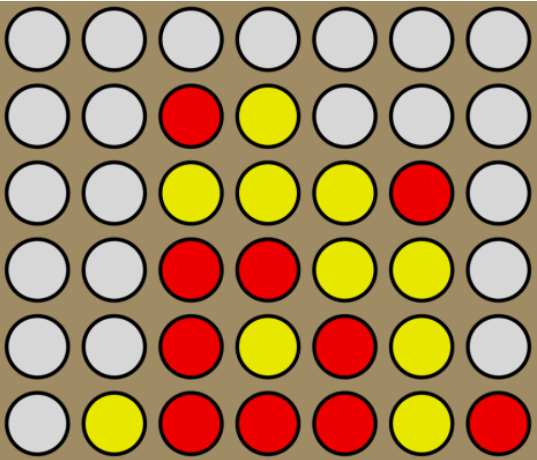
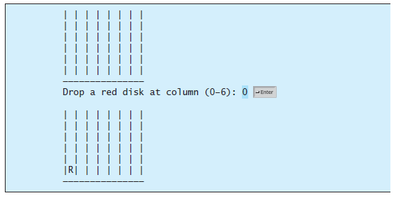
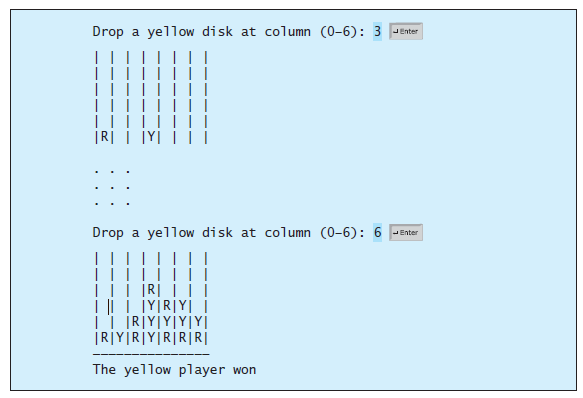

# Connect-Four-Game-in-Java
Connect four is a two-player board game in which the players alternately drop colored disks into a seven-column, six-row vertically suspended grid.

The objective of the game is to connect four same-colored disks in a row, a column, or a diagonal before your opponent can do likewise. The program prompts two players to drop a red or yellow disk alternately. Whenever a disk is dropped, the program redisplays the board on the console and determines the status of the game (win, draw, or continue).

